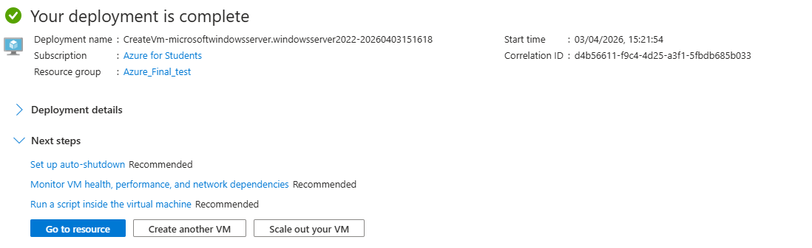

# Azure-Cloud-Identity-management-lab
This repository documents my hands-on experience with Microsoft Azure, Infrastructure as a Service (IaaS), and modern identity management. This lab demonstrates my ability to deploy, configure, and manage cloud resources in a cost-effective and secure manner.

## 🚀 Key Tasks Accomplished:
* ***Microsoft Entra ID (Azure AD)***: Managed cloud-native user identities and global security groups.
* ***Azure Virtual Machines***: Deployed and configured a Windows Server 2022 instance from scratch.
* ***Resource Optimization***: Selected and deployed cost-efficient resources (B-series burstable VMs) and managed regional quotas (East US).
* ***Network Security***: Configured Network Security Groups (NSG) to define inbound/outbound rules, ensuring a secure RDP (Port 3389) management environment.

 ## 🛠️ Technical Specifications
* ***Operating System***: Windows Server 2022 Datacenter Azure Edition
* ***Instance Type***: Standard_B2ls_v2 (2 vCPUs, 4 GiB memory)
* ***Region***: Switzerland North (Optimized for availability)
* ***Connectivity***: Remote Desktop Protocol (RDP)

## 📸 Lab Documentation
***1. Cloud Resource Deployment***

This screenshot shows the successful deployment of the virtual infrastructure. It confirms the orchestration of the Virtual Network (VNet), Public IP, and Network Interfaces

***2. Remote Management & Server Manager***

Once the VM was provisioned, I established a secure RDP connection. This view shows the Server Manager dashboard, confirming the server is ready for role installation (e.g., IIS, AD DS, or File Services).

***3. Identity & Access Management (Entra ID)***

A view of the Microsoft Entra ID portal showing the creation of user accounts and administrative groups, simulating a real-world corporate identity structure.

## 🧠 Lessons Learned
* ***Troubleshooting***: Successfully navigated Azure regional quota restrictions by analyzing "Raw Error" logs and adjusting deployment regions.
* ***Cost Control***: Implemented "Stop (deallocated)" procedures and auto-shutdown schedules to maximize the efficiency of cloud credits.
* ***Security First***: Learned the importance of narrowing inbound port rules to specific IP ranges to prevent unauthorized access.
